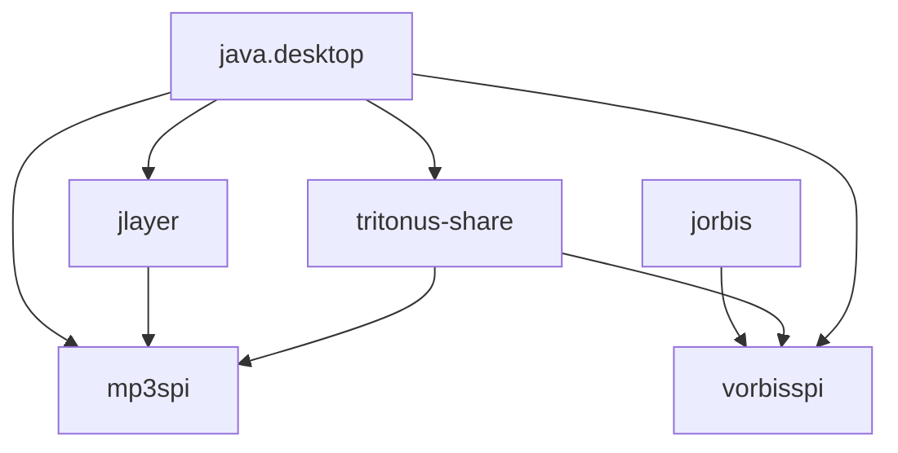
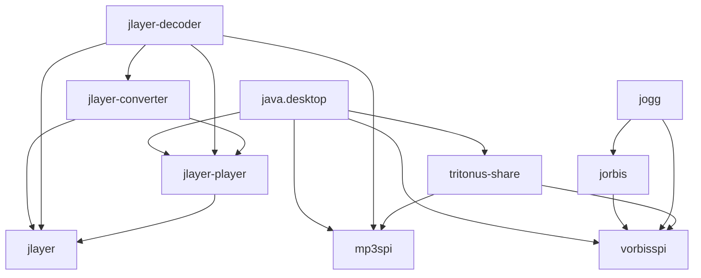
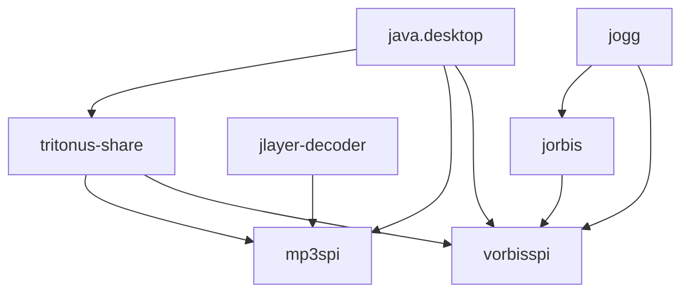

# Java Audio Stack

Apologies for the repo name. I know it's pretty generic, but in my defense the other
repo which does something similar is just called [soundlibs](https://github.com/pdudits/soundlibs)
so there is some precedent.

## Usage

Most people will just want to include the artifacts for `mp3spi` and/or `vorbisspi`.

```xml
<dependency>
    <groupId>dev.mccue</groupId>
    <artifactId>mp3spi</artifactId>
    <version>0.0.7</version>
</dependency>
```

```xml
<dependency>
    <groupId>dev.mccue</groupId>
    <artifactId>vorbisspi</artifactId>
    <version>0.0.7</version>
</dependency>
```

From there, load up an audio file. [There are a bunch of old tutorials online for that](https://odoepner.wordpress.com/2013/07/19/play-mp3-or-ogg-using-javax-sound-sampled-mp3spi-vorbisspi/).


## What is this

There are two audio libraries that pop up as dependencies relatively often. `mp3spi` and `vorbisspi`.
These provide the ability for the [Java Sound API](https://www.oracle.com/java/technologies/java-sound-api.html) 
to play MP3 and OGG files.

The history of those libraries is a bit fuzzy to me, but from what I know at this point

* They were originally made as part of the "tritonus" project, which was an open source implementation
of the Java sound APIs for linux.
* At some point later they were bundled up and published to maven central under the group [com.googlecode.soundlibs](https://central.sonatype.com/search?q=g%3Acom.googlecode.soundlibs)
and those artifacts are still managed by the folks under the [soundlibs](https://github.com/pdudits/soundlibs) repo.

This is, for better or worse, just a repackaging of those libraries.


I *did* make some changes that you might consider important.

* Any usages of the security manager have been removed. This is deprecated for removal so there is potentially a future
Java version where bytecode that references security manager classes is problematic.
* I removed calls to `new Integer` and other methods that have been deprecated for removal
* I split the `jlayer` dependency that underlies `mp3spi` into three submodules. This means the core of
`jlayer-decoder` which parses MP3 files is available without a dependence on `java.desktop`. This was already
done by the [libGDX](https://github.com/libgdx/jlayer-gdx) people - I assume for a similar desire.
* I split `jorbis` into `jogg` and `jorbis`.
* Everything now has a proper module-info. If everything in your dependency tree has a module-info you can
use `jlink` and `jpackage` to bundle up your app without extra configuration.
* Everything has been repackaged. This solves [some of the issues](https://github.com/pdudits/soundlibs/issues/14)
that the original repo faces with respect to modularization. It also means that if you end up with both this
and the original libraries in your project it isn't the end of the world.
* Minimum compatibility has been bumped to Java 17. If you care about the module system at all,
chances are you are making an app on a newer JDK too.

Best I can tell, there isn't much merit to using the [tritonus](https://www.tritonus.org/)
implementation of the [Java Sound API](https://www.oracle.com/java/technologies/java-sound-api.html) now that the JDK
is open source. I assume that providing an open source version was the original raison d'être. So I did not repackage
the `tritonus-all` dependency.

Both `mp3spi` and `vorbisspi` depend on a set of classes that came from `tritonus-share`, so it was easiest to make
that its own module.

The graph of dependencies for the original set of libraries looks like this.




With the changes in this the graph looks like this.



Which is a lot more confusing to look at, but the big difference is
that `jlayer-player`, `jlayer-converter`, and `jlayer` no longer are part of `mp3spi`, only `jlayer-decoder` is. Take those out and it is a lot more familiar.



## Misc.

[Original JLayer Site](https://web.archive.org/web/20210108055829/http://www.javazoom.net/javalayer/javalayer.html)
[Original JLayer Javadocs](https://web.archive.org/web/20200129011439/http://www.javazoom.net/javalayer/docs/docs1.0/index.html)

Coordinates for constituent modules. Most won't have a need to touch these.

```xml
<dependency>
    <groupId>dev.mccue</groupId>
    <artifactId>jlayer</artifactId>
    <version>0.0.7</version>
</dependency>
```

```xml
<dependency>
    <groupId>dev.mccue</groupId>
    <artifactId>jlayer-decoder</artifactId>
    <version>0.0.7</version>
</dependency>
```


```xml
<dependency>
    <groupId>dev.mccue</groupId>
    <artifactId>jlayer-converter</artifactId>
    <version>0.0.7</version>
</dependency>
```

```xml
<dependency>
    <groupId>dev.mccue</groupId>
    <artifactId>jlayer-player</artifactId>
    <version>0.0.7</version>
</dependency>
```

```xml
<dependency>
    <groupId>dev.mccue</groupId>
    <artifactId>jogg</artifactId>
    <version>0.0.7</version>
</dependency>
```

```xml
<dependency>
    <groupId>dev.mccue</groupId>
    <artifactId>jorbis</artifactId>
    <version>0.0.7</version>
</dependency>
```

```xml
<dependency>
    <groupId>dev.mccue</groupId>
    <artifactId>tritonus-share</artifactId>
    <version>0.0.7</version>
</dependency>
```